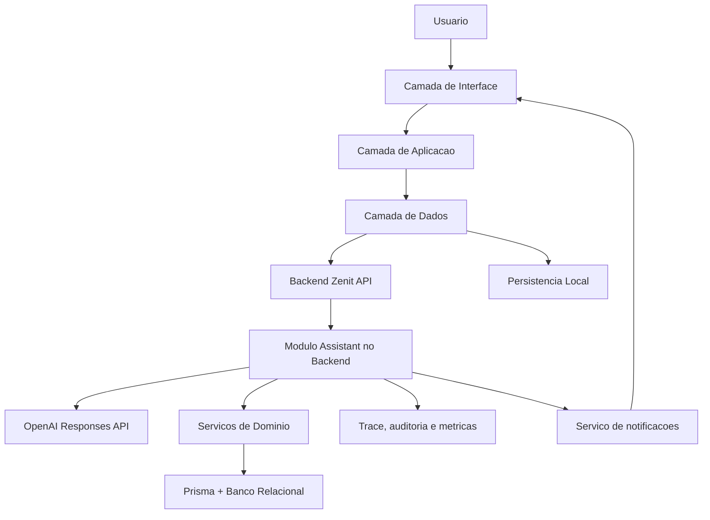
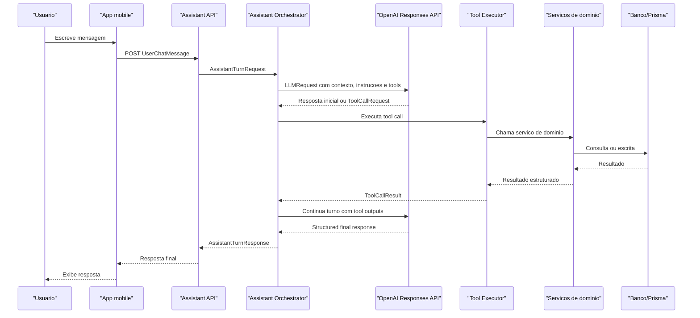
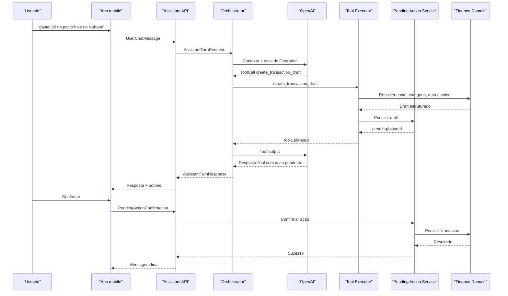
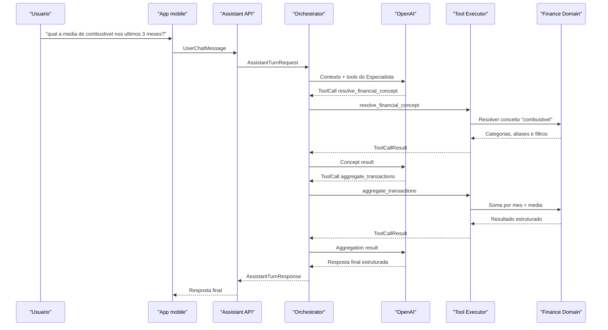
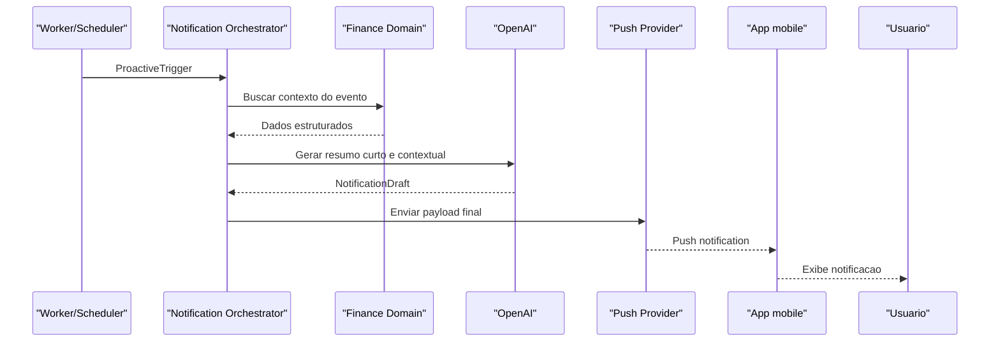

# Zenit Cash Mobile - Especificacao Tecnica da Stack e Orquestracao da IA

Data: 2026-06-03
Status: Draft inicial
Diretorio implementado no monorepo: `apps/zenit-cash-mobile`
Relacionada a: `docs/zenit-cash-mobile-spec.md`

## 1. Objetivo

Definir a stack tecnica recomendada para o futuro `zenit-cash-mobile` e descrever, de forma precisa, como funcionara a orquestracao das interacoes com IA.

Este documento cobre:

- stack recomendada por camada;
- organizacao sugerida no monorepo;
- responsabilidades de cada camada no app e no backend;
- fluxo de mensagens entre usuario, mobile, backend, IA e servicos de dominio;
- contratos iniciais para request/response do assistente;
- politicas de execucao, confirmacao, auditoria e notificacao.

## 2. Decisoes estruturais

### 2.1 Novo app

O `zenit-cash-mobile` deve nascer como um app novo, separado do app Flutter legado em `mobile/`.

Motivo:

- o app Flutter atual e um produto estreito de orcamento diario local-first;
- o novo app sera extensao direta do dominio `zenit-cash`;
- o novo app exigira integracao profunda com autenticacao, app grants, assistente, consultas analiticas, notificacoes e capacidades multi-tenant;
- o monorepo atual e majoritariamente `Node + TypeScript`, o que favorece alinhamento de contratos e reaproveitamento.

### 2.2 Stack principal recomendada

Recomendacao:

- `Expo + React Native + TypeScript`

Motivos principais:

- melhor alinhamento com o backend e com os apps web existentes;
- melhor reaproveitamento de tipos, contratos, conceitos e convencoes do ecossistema atual;
- menor friccao para compartilhar autenticacao, permissao, tracing e schemas;
- bom suporte para build, distribuicao interna, notificacoes, secure storage e navegacao multiplataforma.

### 2.3 Posicionamento do Flutter legado

O app em `mobile/` deve continuar existindo como produto separado, sem servir de base para o `zenit-cash-mobile`.

Ele pode inspirar:

- abordagem local-first em certos fluxos;
- uso de sync progressivo;
- cuidado com UX de baixo atrito.

Mas nao deve determinar a stack do novo app.

## 3. Stack recomendada por camada

| Camada | Stack recomendada | Papel principal |
| --- | --- | --- |
| Runtime mobile | Expo + React Native | Shell nativo multiplataforma |
| Linguagem | TypeScript | Tipagem compartilhavel com backend/web |
| Navegacao | Expo Router | Roteamento por arquivos, deep link e estrutura universal |
| UI base | React Native primitives + tema proprio | Controle visual e identidade do produto |
| Gestos/areas seguras | `react-native-gesture-handler`, `react-native-safe-area-context` | UX nativa e consistente |
| Icones/graficos | `lucide-react-native`, `react-native-svg` | Iconografia e graficos leves |
| Estado local de UI | Zustand | Estado efemero e simples |
| Estado remoto/cache | TanStack Query | Fetching, cache, invalidacao, refetch e mutacoes |
| HTTP client | Axios | Cliente padronizado para backend |
| Formularios | React Hook Form + Zod | Formularios tipados e validacao |
| Sessao segura | Expo SecureStore | Tokens e segredos locais |
| Persistencia local | Expo SQLite | Cache local, drafts e filas futuras |
| Notificacoes | Expo Notifications | Push e notificacoes locais |
| Build/distribuicao | EAS Build | Builds Android/iOS, internal distribution e automacao |
| Testes unitarios | Jest + React Native Testing Library | Testes de componente e comportamento |
| Testes E2E | Detox | Fluxos criticos em aparelho/emulador |

## 4. Referencias oficiais que sustentam a stack

- Expo Router e descrito como biblioteca open-source para apps universais React Native com Expo, com roteamento baseado em arquivos e navegação entre Android, iOS e web. Fonte: [Expo Router Introduction](https://docs.expo.dev/router/introduction/).
- A documentacao da Expo recomenda criar novos apps com `create-expo-app`, e o guia mostra `Expo Router` como caminho padrao para novos projetos. Fonte: [Expo Router Introduction](https://docs.expo.dev/router/introduction/).
- `expo-secure-store` e descrito como biblioteca para armazenar pares chave-valor de forma criptografada e segura localmente no dispositivo. Fonte: [Expo SecureStore](https://docs.expo.dev/versions/latest/sdk/securestore/).
- `expo-sqlite` da acesso a banco SQLite e persiste os dados entre reinicios do app. Fonte: [Expo SQLite](https://docs.expo.dev/versions/latest/sdk/sqlite/).
- `expo-notifications` permite obter token nativo de push para FCM e APNs, alem de trabalhar com notificacoes locais e Expo Push Service. Fonte: [Expo Notifications](https://docs.expo.dev/versions/latest/sdk/notifications/).
- `EAS Build` e o servico hospedado para gerar binaries Android/iOS e facilitar distribuicao e automacao. Fonte: [EAS Build](https://docs.expo.dev/build/introduction/).
- O guia oficial do React Native aponta TypeScript como default em novos projetos e templates populares, alem de bom encaixe com Expo. Fonte: [Using TypeScript](https://reactnative.dev/docs/typescript).
- O guia oficial do TanStack Query para React Native afirma que React Query funciona out of the box com React Native. Fonte: [TanStack Query for React Native](https://tanstack.com/query/latest/docs/framework/react/react-native).

## 5. Estrutura recomendada no monorepo

```text
apps/
  zenit-cash/
  zenit-cash-mobile/
packages/
  shared-users-core/
  assistant-contracts/
  mobile-design-tokens/
backend/
  src/
    modules/
      assistant/
```

### 5.1 `apps/zenit-cash-mobile`

Novo app React Native com Expo.

### 5.2 `packages/shared-users-core`

Ja existente. Deve continuar como base para:

- chaves de sessao compartilhadas;
- identificacao de app;
- grants e access model.

### 5.3 `packages/assistant-contracts`

Novo pacote recomendado para:

- tipos de request/response do assistente;
- schemas de mensagens e acoes pendentes;
- enums de modo (`OPERATOR`, `SPECIALIST`);
- contratos de cards, fontes, sugestoes e estados.

### 5.4 `packages/mobile-design-tokens`

Pacote recomendado para:

- cores;
- espacamentos;
- tipografia;
- elevation;
- motion tokens;
- variantes de componentes.

### 5.5 `backend/src/modules/assistant`

Modulo novo do backend para:

- sessoes do assistente;
- orquestracao de turnos;
- runtime de ferramentas;
- politicas de confirmacao;
- tracing e auditoria;
- notificacoes proativas.

## 6. Arquitetura em camadas do app mobile

## 6.1 Visao geral



## 6.2 Camada de Interface

Responsavel por:

- telas, componentes e layouts;
- navegacao;
- renderizacao da home, quick actions e chat;
- exibicao de cards, tabelas compactas, alertas e respostas do assistente;
- captura de input por texto e futuramente voz;
- exibicao de status de carregamento, erro, reconexao e confirmacao.

Tecnologias sugeridas:

- React Native primitives;
- Expo Router;
- `react-native-safe-area-context`;
- `react-native-gesture-handler`;
- `react-native-svg`;
- `lucide-react-native`.

Regra:

- a interface nunca fala direto com OpenAI;
- a interface nunca decide regra financeira;
- a interface so conversa com a camada de aplicacao do app e com o backend Zenit.

## 6.3 Camada de Aplicacao

Responsavel por:

- coordenar casos de uso do app;
- transformar eventos da UI em intents;
- decidir quando abrir modal, sheet, confirmacao ou navegacao;
- integrar chat, home e quick actions;
- preparar contexto minimo para requests ao backend;
- manter estado efemero de interacao.

Tecnologias sugeridas:

- Zustand para estado local de UI;
- hooks e services internos por feature.

Exemplos de use cases:

- `sendAssistantMessage`
- `confirmPendingAction`
- `loadHomeSnapshot`
- `markTransactionAsSettled`
- `openTransactionsFromInsight`

## 6.4 Camada de Dados

Responsavel por:

- chamadas HTTP;
- cache remoto;
- persistencia local;
- sincronizacao de drafts e historico recente;
- refresh de sessao;
- serializacao de payloads.

Tecnologias sugeridas:

- Axios;
- TanStack Query;
- Expo SecureStore;
- Expo SQLite.

Separacao proposta:

- `SecureStore`: apenas segredos e identificadores sensiveis;
- `SQLite`: drafts, cache local, sessoes resumidas do chat, pending actions, snapshots recentes e filas futuras.

## 6.5 Camada de Seguranca e Sessao

Responsavel por:

- armazenar `token`, `refreshToken` e `companyId` com seguranca;
- anexar `Authorization`, `X-App-Key` e `X-Company-Id` nas requisicoes;
- lidar com refresh token;
- suportar troca de empresa ativa;
- limpar sessao e dados sensiveis no logout.

Base conceitual:

- reaproveitar naming e semantica do pacote `@zenit/shared-users-core`;
- alinhar o comportamento com o `zenit-cash` web.

## 6.6 Camada de Persistencia Local

Objetivo:

- suportar retomada rapida do app;
- preservar drafts e turnos recentes do chat;
- permitir comportamento resiliente sob conectividade intermitente;
- abrir espaco para fila offline controlada em fases futuras.

Recomendacao:

- usar `expo-sqlite` como base local principal;
- nao usar `SecureStore` para payloads grandes;
- nao usar `AsyncStorage` como base do dominio do app.

## 6.7 Camada de Observabilidade

Responsavel por:

- logs do app;
- telemetria de navegação;
- latencia por tipo de request;
- falhas de UX e rede;
- eventos de uso do assistente.

Sugestao inicial:

- logs estruturados em dev;
- integracao futura com Sentry ou equivalente;
- correlacao por `sessionId`, `assistantSessionId`, `assistantTurnId` e `clientMessageId`.

## 7. Arquitetura em camadas do backend

## 7.1 Fundacao existente

O backend atual ja oferece base adequada para o modulo do assistente:

- `Node + TypeScript`
- `Express`
- `Prisma`
- `Zod`
- grants por app;
- autenticacao;
- multi-tenancy por empresa;
- configuracao OpenAI por empresa.

## 7.2 Novo modulo `assistant`

Estrutura sugerida:

```text
backend/src/modules/assistant/
  assistant.routes.ts
  assistant.controller.ts
  assistant.validator.ts
  services/
    assistant-session.service.ts
    assistant-message.service.ts
    assistant-orchestrator.service.ts
    mode-router.service.ts
    prompt-builder.service.ts
    llm-runtime.service.ts
    tool-registry.service.ts
    tool-executor.service.ts
    pending-action.service.ts
    notification-orchestrator.service.ts
    assistant-trace.service.ts
  tools/
    operator/
    specialist/
  types/
    assistant.types.ts
```

## 7.3 Responsabilidades dos componentes do backend

### `assistant.controller`

Entrada HTTP para:

- criar sessao;
- enviar mensagem;
- confirmar acao pendente;
- listar historico recente;
- obter resposta de um turno especifico.

### `assistant-session.service`

Responsavel por:

- criar e recuperar sessoes;
- associar sessao a usuario, empresa e app;
- carregar contexto minimo persistido;
- encerrar, arquivar ou compactar historico.

### `assistant-message.service`

Responsavel por:

- persistir mensagens de usuario e assistente;
- normalizar metadados;
- vincular mensagem a turno, sessao e resposta final.

### `mode-router.service`

Responsavel por:

- apontar modo dominante da interacao (`OPERATOR` ou `SPECIALIST`);
- eventualmente marcar submodo do especialista (`ANALYTIC`, `DIAGNOSIS`, `RECOMMENDATION`);
- sinalizar se a mensagem exige confirmacao, esclarecimento ou execucao direta.

Observacao:

- a decisao continua sendo da IA em runtime;
- este service representa a camada que registra e interpreta essa decisao dentro do backend.

### `prompt-builder.service`

Responsavel por:

- montar instrucoes do sistema;
- anexar contexto de tenant, usuario, timezone, permissoes e politicas;
- anexar schemas das ferramentas;
- limitar contexto para nao inflar tokens sem necessidade.

### `llm-runtime.service`

Responsavel por:

- falar com a OpenAI;
- usar `Responses API` como endpoint principal;
- manter stateful turns por `conversation` ou `previous_response_id` conforme a politica escolhida;
- lidar com streaming, function calling e Structured Outputs;
- aplicar politicas de timeout e retries.

### `tool-registry.service`

Responsavel por:

- declarar quais ferramentas existem;
- expor descricoes, schemas e permissoes;
- separar ferramentas do `Operador` e do `Especialista`;
- bloquear ferramentas nao permitidas para determinado usuario, empresa ou modo.

### `tool-executor.service`

Responsavel por:

- executar chamadas de ferramentas solicitadas pelo modelo;
- validar argumentos com `Zod`;
- chamar servicos de dominio do backend;
- devolver resultado estruturado para o runtime da IA.

### `pending-action.service`

Responsavel por:

- criar drafts de acao;
- persistir comandos aguardando confirmacao humana;
- confirmar, cancelar ou expirar acoes pendentes;
- garantir que escrita financeira sensivel nao ocorra sem confirmacao quando a politica exigir.

### `assistant-trace.service`

Responsavel por:

- registrar cada turno;
- registrar ferramenta chamada, argumentos e resultado;
- medir custo, latencia e taxa de falha;
- suportar auditoria.

### `notification-orchestrator.service`

Responsavel por:

- receber triggers do sistema;
- decidir se uma notificacao proativa deve ser gerada;
- pedir ao `Especialista` um resumo curto e contextual;
- enviar o payload final ao servico de notificacoes.

## 8. Stack da IA recomendada

## 8.1 Direcao geral

Recomendacao:

- `OpenAI Responses API`
- `function calling`
- `Structured Outputs`

Motivo:

- a `Responses API` e descrita como a interface mais avancada da OpenAI para gerar respostas, permitindo interacoes stateful, tool use e function calling. Fonte: [Responses API Reference](https://platform.openai.com/docs/api-reference/responses).
- o guia oficial de function calling define o fluxo de tools, tool calls e tool call outputs como conversa multi-step entre aplicacao e modelo. Fonte: [Function calling](https://platform.openai.com/docs/guides/function-calling?api-mode=responses).
- o guia oficial de Structured Outputs recomenda schema estruturado para respostas aderentes ao formato definido pela aplicacao. Fonte: [Structured Outputs](https://platform.openai.com/docs/guides/structured-outputs?lang=javascript).

## 8.2 Uso recomendado

### Para acao e integracao

Usar `function calling` com ferramentas registradas pelo backend.

### Para resposta final ao app

Usar `Structured Outputs` para garantir que a resposta do assistente siga um schema conhecido.

### Para conversas multi-turno

Usar a mecanica de conversa da `Responses API`, persistindo referencias internas no backend.

## 8.3 Politica de modelos

Politica inicial recomendada:

- 1 runtime de modelo por empresa;
- ler modelo configurado pelo tenant no backend;
- permitir evolucao futura para split entre:
  - modelo leve para turnos simples do `Operador`;
  - modelo mais robusto para analise e diagnostico do `Especialista`.

Na V1, manter uma configuracao simples e centralizada.

## 9. Ferramentas internas do assistente

As ferramentas sao o contrato entre a IA e o backend.

### 9.1 Ferramentas do `Operador`

Exemplos:

- `create_transaction_draft`
- `update_transaction_draft`
- `confirm_transaction_draft`
- `cancel_pending_action`
- `settle_transaction`
- `list_due_items`
- `get_recent_transactions`
- `create_alert_draft`

### 9.2 Ferramentas do `Especialista`

Exemplos:

- `resolve_financial_concept`
- `aggregate_transactions`
- `list_supporting_transactions`
- `compare_periods`
- `budget_risk_check`
- `cash_pressure_summary`
- `credit_card_pressure_summary`
- `monthly_situation_summary`

### 9.3 Regra central

A IA nao consulta o banco diretamente.

Ela so pode:

- pedir uso de uma ferramenta;
- receber o resultado estruturado dessa ferramenta;
- com base nisso, montar a resposta final.

## 10. Tipos de mensagem no sistema

Para entender a orquestracao, e importante separar as mensagens.

## 10.1 Mensagens externas

Mensagens trafegadas entre app, backend e notificacoes.

| Tipo | Remetente | Destinatario | Transporte | Sincrona | Persistida |
| --- | --- | --- | --- | --- | --- |
| `UserChatMessage` | App mobile | Backend API | HTTPS JSON | Sim | Sim |
| `AssistantTurnResponse` | Backend API | App mobile | HTTPS JSON | Sim | Sim |
| `PendingActionConfirmation` | App mobile | Backend API | HTTPS JSON | Sim | Sim |
| `PushNotificationPayload` | Backend notification service | App mobile | Push | Assincrona | Opcional |

## 10.2 Mensagens internas do backend

Mensagens que coordenam o assistente dentro do servidor.

| Tipo | Remetente | Destinatario | Transporte | Sincrona | Persistida |
| --- | --- | --- | --- | --- | --- |
| `AssistantTurnRequest` | Controller | Orchestrator | Chamada interna | Sim | Sim |
| `ModeDecision` | Orchestrator/LLM | Mode Router | Chamada interna | Sim | Sim |
| `LLMRequest` | LLM Runtime | OpenAI | HTTPS | Sim | Nao localmente, mas traçada |
| `ToolCallRequest` | LLM Runtime | Tool Executor | Chamada interna | Sim | Sim |
| `ToolCallResult` | Tool Executor | LLM Runtime | Chamada interna | Sim | Sim |
| `PendingActionCreated` | Tool Executor | Pending Action Service | Chamada interna | Sim | Sim |
| `AssistantTraceRecord` | Orchestrator | Trace Service | Chamada interna | Sim | Sim |

## 10.3 Eventos proativos

| Tipo | Remetente | Destinatario | Transporte | Sincrona | Persistida |
| --- | --- | --- | --- | --- | --- |
| `ProactiveTrigger` | Worker / scheduler | Notification Orchestrator | Interno | Nao | Sim |
| `NotificationDraftRequest` | Notification Orchestrator | LLM Runtime | HTTPS | Sim | Sim |
| `NotificationDeliveryCommand` | Notification Orchestrator | Push provider | HTTPS | Assincrona | Sim |

## 11. Fluxo macro de um turno do assistente



## 12. Fluxo detalhado do `Operador`

Exemplo:

`gastei 82 no posto hoje no Nubank`

### 12.1 Objetivo

O `Operador` deve transformar a mensagem em acao operacional segura.

### 12.2 Etapas

1. Usuario envia mensagem no app.
2. App envia `UserChatMessage` para o backend.
3. Backend abre um novo `AssistantTurn`.
4. Orchestrator chama a OpenAI com:
   - instrucao do sistema;
   - historico recente;
   - contexto do usuario/empresa;
   - schemas das tools do `Operador`.
5. O modelo decide:
   - modo dominante = `OPERATOR`;
   - tool call = `create_transaction_draft`.
6. `Tool Executor` chama a ferramenta.
7. A ferramenta chama servicos de dominio para:
   - validar conta/cartao;
   - resolver categoria;
   - montar draft.
8. O draft e persistido como `PendingAction`.
9. O resultado do draft volta ao modelo.
10. O modelo monta a resposta final estruturada:
   - texto curto;
   - resumo do lancamento;
   - botoes `Confirmar`, `Editar`, `Cancelar`.
11. Backend devolve `AssistantTurnResponse` ao app.
12. Se o usuario confirmar:
   - app envia `PendingActionConfirmation`;
   - backend executa `confirm_transaction_draft`;
   - resposta final do turno de confirmacao volta ao app.

### 12.3 Diagrama



## 13. Fluxo detalhado do `Especialista`

Exemplo:

`qual a media de combustivel nos ultimos 3 meses?`

### 13.1 Objetivo

Responder com precisao, criterio explicito e base rastreavel.

### 13.2 Etapas

1. Usuario envia pergunta.
2. App envia `UserChatMessage`.
3. Backend cria turno.
4. Orchestrator chama a OpenAI com tools do `Especialista`.
5. O modelo decide:
   - modo dominante = `SPECIALIST`;
   - tool call 1 = `resolve_financial_concept`;
   - tool call 2 = `aggregate_transactions`.
6. `Tool Executor` chama essas tools.
7. As tools consultam servicos do dominio financeiro.
8. Os resultados estruturados voltam ao modelo.
9. O modelo devolve resposta final em schema estruturado:
   - resposta textual;
   - criterio adotado;
   - periodo;
   - metricas;
   - opcao de abrir os lancamentos de suporte.

### 13.3 Diagrama



## 14. Fluxo de notificacoes proativas

Exemplo:

- vencimento se aproximando;
- risco de estouro de orcamento;
- pressao de caixa da semana.

### 14.1 Regra

Aqui o remetente inicial nao e o usuario.

O fluxo comeca com um evento interno do sistema.

### 14.2 Diagrama



## 15. Quem fala com quem

Esta e a resposta direta para a sua duvida sobre remetente, destinatario e direcao:

### 15.1 O app mobile fala com

- `Backend Zenit API`

O app nunca fala direto com:

- OpenAI;
- banco;
- ferramentas internas.

### 15.2 O backend fala com

- OpenAI Responses API;
- servicos internos de dominio;
- banco;
- servico de notificacoes.

### 15.3 A OpenAI fala com

- apenas o backend

E "fala" via respostas da API contendo:

- texto;
- function calls;
- output estruturado.

### 15.4 As ferramentas falam com

- servicos de dominio do backend

Elas nao falam com o mobile.

### 15.5 O banco fala com

- apenas os servicos de dominio / Prisma

Nunca com o modelo e nunca com o app.

## 16. Contratos de request/response do assistente

## 16.1 Request do app para o backend

```json
{
  "sessionId": "asst_sess_01",
  "clientMessageId": "cli_msg_01",
  "message": {
    "sender": "USER",
    "channel": "MOBILE_CHAT",
    "text": "qual a media de combustivel nos ultimos 3 meses?"
  },
  "context": {
    "screen": "assistant",
    "timezone": "America/Sao_Paulo",
    "locale": "pt-BR"
  }
}
```

## 16.2 Request interno do backend para o runtime da IA

```json
{
  "assistantSessionId": "asst_sess_01",
  "assistantTurnId": "turn_01",
  "tenant": {
    "companyId": 12,
    "userId": 55,
    "appKey": "zenit-cash"
  },
  "modeHints": [],
  "conversation": [],
  "runtimeContext": {
    "timezone": "America/Sao_Paulo",
    "today": "2026-06-03",
    "permissions": {
      "manageFinancialAccounts": true,
      "manageFinancialCategories": true
    }
  },
  "tools": [
    "resolve_financial_concept",
    "aggregate_transactions",
    "list_supporting_transactions"
  ]
}
```

## 16.3 Tool call do modelo para o backend

```json
{
  "tool": "aggregate_transactions",
  "arguments": {
    "concept": "fuel",
    "period": {
      "preset": "LAST_3_MONTHS"
    },
    "metric": "AVERAGE_MONTHLY_SPEND",
    "statusPolicy": "DEFAULT"
  }
}
```

## 16.4 Tool result do backend para o modelo

```json
{
  "tool": "aggregate_transactions",
  "ok": true,
  "result": {
    "periodUsed": {
      "from": "2026-03-01",
      "to": "2026-05-31"
    },
    "currency": "BRL",
    "monthlyTotals": [
      { "month": "2026-03", "amount": 420.0 },
      { "month": "2026-04", "amount": 510.0 },
      { "month": "2026-05", "amount": 390.0 }
    ],
    "averageAmount": 440.0,
    "supportingTransactionCount": 11
  }
}
```

## 16.5 Response final do backend para o app

```json
{
  "sessionId": "asst_sess_01",
  "assistantTurnId": "turn_01",
  "mode": "SPECIALIST",
  "message": {
    "id": "msg_01",
    "sender": "ASSISTANT",
    "text": "Sua media de gasto com combustivel nos ultimos 3 meses fechados foi de R$ 440,00."
  },
  "explanation": {
    "criteria": "Considerei despesas efetivadas classificadas como combustivel.",
    "period": "01/03/2026 a 31/05/2026"
  },
  "cards": [
    {
      "type": "METRIC",
      "title": "Media mensal",
      "value": "R$ 440,00"
    }
  ],
  "actions": [
    {
      "type": "OPEN_SUPPORTING_TRANSACTIONS",
      "label": "Ver lancamentos"
    }
  ],
  "pendingAction": null
}
```

## 17. Estrutura da resposta do assistente

Recomendacao: toda resposta do assistente deve seguir um envelope padrao.

Campos principais:

- `mode`
- `message.text`
- `explanation.criteria`
- `explanation.period`
- `cards`
- `actions`
- `pendingAction`
- `sources`
- `telemetry`

Motivo:

- facilita renderizacao no app;
- permite medir comportamento;
- diferencia texto humano de metadados operacionais;
- evita depender de parsing fragil da resposta.

## 18. Politica de confirmacao

### 18.1 Regra

Toda escrita financeira sensivel deve passar por uma das duas politicas:

- `direct_safe_execution`
- `draft_then_confirm`

### 18.2 Quando usar `draft_then_confirm`

- criacao de transacao por linguagem natural;
- alteracao de conta/cartao de uma transacao;
- marcacao de pagamento/recebimento em valor relevante;
- criacao de alertas financeiros;
- qualquer acao com ambiguidade significativa.

### 18.3 Quando `direct_safe_execution` pode ser aceitavel

- leitura;
- reabertura de detalhes;
- refresh de informacao;
- acao irrelevante financeiramente;
- comandos explicitamente confirmados no proprio componente da UI.

## 19. Politica de contexto

O backend deve montar contexto em camadas:

1. `contexto fixo`
   - identidade do app;
   - idioma;
   - timezone;
   - politicas gerais.

2. `contexto do tenant`
   - empresa ativa;
   - modelo configurado;
   - regras especificas.

3. `contexto do usuario`
   - permissoes;
   - preferencias;
   - ultimo estado relevante.

4. `contexto da conversa`
   - ultimas mensagens necessarias;
   - acoes pendentes;
   - objetos recem consultados.

5. `contexto de ferramentas`
   - schemas;
   - limites de uso;
   - nomes e descricoes.

Regra:

- nao despejar dados crus em excesso no prompt;
- usar tools para buscar detalhe quando necessario.

## 20. Politica de receita vs planejamento aberto

Arquitetura recomendada:

- o baseline passa sempre pelo orquestrador da IA;
- em fase posterior, receitas frequentes podem ser resolvidas com fast path deterministico para economizar custo.

Exemplos de fast path futuro:

- quanto gastei com X no periodo Y;
- resumo de vencimentos;
- comparacao com mes anterior.

Na V1, porem, o desenho mais simples e mais coerente e:

- `1 assistente`
- `1 orquestrador`
- `1 runtime de tools`

## 21. Persistencia recomendada para o assistente

Entidades sugeridas:

- `AssistantSession`
- `AssistantMessage`
- `AssistantTurn`
- `AssistantPendingAction`
- `AssistantToolTrace`

Objetivo:

- retomar conversa;
- abrir historico recente;
- auditar o que o modelo pediu;
- medir custo, qualidade e falha;
- dar suporte a confirmacoes e notificacoes futuras.

## 22. Roadmap tecnico recomendado

### Fase A - Fundacao da stack

- criar `apps/zenit-cash-mobile` com Expo Router e TypeScript;
- configurar ambiente, build e base de navegacao;
- implementar sessao, headers e empresa ativa;
- criar pacote `assistant-contracts`.

### Fase B - Assistente V1

- criar modulo `assistant` no backend;
- implementar sessao, envio de mensagens e response envelope;
- implementar runtime com Responses API;
- implementar tools basicas do `Operador` e do `Especialista`.

### Fase C - Home + quick actions

- integrar assistente ao app;
- construir home com snapshot financeiro;
- abrir acoes frequentes conectadas ao `Operador`.

### Fase D - Notificacoes e proatividade

- adicionar worker e notification orchestrator;
- disparar alertas de vencimento, risco e resumo contextual.

## 23. Decisoes recomendadas neste momento

1. Criar `zenit-cash-mobile` como app novo em `apps/`.
2. Usar `Expo + React Native + TypeScript`.
3. Usar `Responses API + function calling + Structured Outputs`.
4. Centralizar toda IA no backend.
5. Impedir qualquer conexao direta do app com OpenAI.
6. Introduzir modulo `assistant` proprio no backend.
7. Padronizar request/response do assistente com schemas compartilhados.
8. Persistir sessoes, turnos, traces e pending actions.

## 24. Proximo passo recomendado

Antes de implementar, fechar dois artefatos complementares:

1. `assistant-contracts.md`
   - schemas finais de request/response
   - enums
   - cards e pending actions

2. `assistant-tools-catalog.md`
   - cada tool
   - finalidade
   - argumentos
   - validacoes
   - retorno
   - politica de confirmacao
