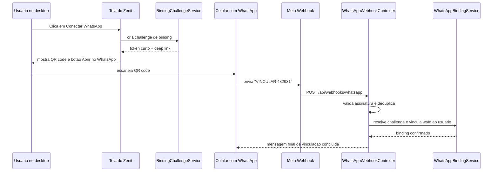
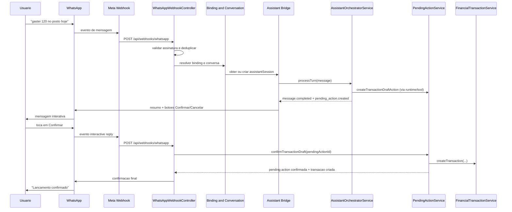

# WhatsApp financial channel technical spec

## Contexto

O Zenit Cash ja possui:

- sessao de assistente persistida no backend;
- orquestracao por turno via `AssistantOrchestratorService`;
- tools de criacao e atualizacao de rascunho;
- `pending actions` para confirmacao humana antes de gravar efeitos financeiros.

Ao mesmo tempo, existe interesse em descartar a dependencia de um app mobile dedicado para captura cotidiana e usar o WhatsApp como canal primario de conversa e criacao de lancamentos.

O problema nao e "como ensinar o WhatsApp a criar transacoes". O problema real e como adicionar um novo canal sem criar um segundo motor financeiro, sem perder auditoria, sem pular confirmacao humana e sem abrir brecha de autenticacao por telefone.

## Estado da implementacao

Implementado nesta fase:

- app `zenit-whatsapp` no catalogo de acesso;
- habilitacao por empresa nas configuracoes;
- grant por usuario no cadastro administrativo;
- onboarding `QR-first` no perfil;
- webhook publico `GET/POST /api/webhooks/whatsapp`;
- binding ativo `1:1` entre `waId` e `userId`;
- uma empresa ativa por vez no canal;
- uma `assistantSession` por empresa dentro do binding;
- respostas em texto simples, com confirmacao e cancelamento por linguagem natural.

Futuro:

- mensagens interativas da Meta;
- notificacoes proativas com template;
- gestao mais rica de contexto e rotacao de conversa.

## Objetivo tecnico

Permitir que um usuario envie mensagens pelo WhatsApp para:

- vincular seu numero ao contexto autenticado do Zenit por um fluxo guiado;
- criar rascunhos de despesa, receita e transferencia;
- corrigir um rascunho pendente;
- confirmar ou cancelar a `pending action`;
- receber a resposta final e o resumo estruturado no proprio WhatsApp.

O objetivo nao inclui substituir a experiencia web para conciliacao, relatorios densos, manutencao estrutural ou configuracoes administrativas.

## Decisao

- tratar o WhatsApp como adaptador de canal sobre o assistente operador ja existente;
- reutilizar `AssistantSessionService`, `AssistantOrchestratorService`, `PendingActionService` e `FinancialTransactionService`;
- nao fazer loopback HTTP do backend para `/api/assistant`; chamar os servicos diretamente;
- expor um webhook publico para verificacao e recebimento de eventos do WhatsApp Business Platform;
- criar um binding ativo `1:1` entre numero/`waId` e `userId`;
- manter contexto de empresa explicito e isolado, com uma empresa ativa por vez no canal;
- adotar onboarding `QR-first`, com link direto como caminho principal;
- responder com texto simples nesta fase, incluindo confirmacao e cancelamento por linguagem natural;
- manter o WhatsApp focado em captura, revisao rapida e follow-up curto;
- manter a web como canal principal para fluxos densos.

## Arquitetura da solucao

### Escopo da fase 1

- onboarding guiado para vincular WhatsApp a partir da sessao web autenticada;
- entrada por texto livre no WhatsApp;
- criacao de rascunho para `EXPENSE`, `INCOME` e `TRANSFER`;
- confirmacao e cancelamento de `pending action`;
- correcoes simples por mensagem textual ou reply button;
- uma conversa ativa por binding;
- uma `assistantSession` ativa por conversa;
- um binding ativo de WhatsApp por usuario;
- um usuario ativo por binding de WhatsApp;
- uma empresa ativa por vez dentro do canal.

Ficam fora da fase 1:

- multiempresa operacional no mesmo chat;
- notificacoes proativas fora da janela de 24 horas;
- fluxos longos de cadastro estrutural;
- conciliacao, dashboards e relatorios por chat.

### Componentes novos

- `WhatsAppWebhookController`
  - `GET /api/webhooks/whatsapp` para verificacao do callback.
  - `POST /api/webhooks/whatsapp` para eventos de mensagem e status.
- `WhatsAppBindingChallengeService`
  - gera token curto, de uso unico e expiracao curta para iniciar o binding.
  - monta QR code, deep link e fallback por e-mail.
- `WhatsAppBindingService`
  - resolve quem e o usuario a partir de `waId` e telefone.
  - resolve qual empresa esta ativa no canal para aquele binding.
- `WhatsAppConversationService`
  - vincula conversa do canal a uma `assistantSession`.
- `WhatsAppInboundNormalizerService`
  - transforma payload bruto da Meta em um contrato interno estavel.
- `WhatsAppAssistantBridgeService`
  - chama `AssistantSessionService` e `AssistantOrchestratorService` diretamente.
- `WhatsAppOutboundService`
  - envia texto, botoes, listas e templates pela Cloud API.
- `WhatsAppMessageLogService`
  - registra inbound, outbound, estados de entrega e deduplicacao.

### Componentes existentes reutilizados

- `AssistantSessionService.createSession(...)`
- `AssistantOrchestratorService.processTurn(...)`
- `PendingActionService.confirmTransactionDraft(...)`
- `PendingActionService.cancelPendingAction(...)`
- `ToolExecutorService` via runtime do assistente
- `FinancialTransactionService.createTransaction(...)`

### Entidades novas

#### `WhatsAppBindingChallenge`

Finalidade: representar uma tentativa de vinculacao iniciada a partir da web.

Campos recomendados:

- `id`
- `companyId`
- `userId`
- `phoneNumber`
- `tokenHash`
- `status`
- `deliveryChannel`
- `expiresAt`
- `consumedAt`
- `lastDeliveredAt`
- `createdAt`
- `updatedAt`

Enums sugeridos:

- `status`: `PENDING`, `CONSUMED`, `EXPIRED`, `CANCELLED`
- `deliveryChannel`: `QR`, `DEEPLINK`, `EMAIL`

Regras:

- o token deve ser curto para caber bem na mensagem pre-preenchida;
- o token deve ser armazenado apenas em forma de hash;
- uma tentativa consumida ou expirada nao pode ser reaproveitada;
- o binding so e concluido quando a mensagem chega do numero do usuario no WhatsApp.

#### `WhatsAppUserBinding`

Finalidade: vincular o usuario do canal ao contexto autenticado do Zenit.

Campos recomendados:

- `id`
- `userId`
- `waId`
- `phoneNumber`
- `displayName`
- `defaultCompanyId`
- `lastActiveCompanyId`
- `optInCapturedAt`
- `isActive`
- `verifiedAt`
- `lastInboundAt`
- `createdAt`
- `updatedAt`
- `disabledAt`

Regras:

- `waId` deve ser unico entre bindings ativos;
- `userId` deve ser unico entre bindings ativos;
- fase 1 assume um unico binding ativo por usuario e por `waId`;
- a empresa usada no onboarding vira `defaultCompanyId` do binding;
- fase 1 opera uma empresa ativa por vez, escolhida a partir do binding;
- o binding deve apontar para a `WhatsAppBindingChallenge` que originou a vinculacao, para auditoria.

#### `WhatsAppConversation`

Finalidade: mapear a conversa do WhatsApp para uma `assistantSession` reutilizavel.

Campos recomendados:

- `id`
- `companyId`
- `userId`
- `bindingId`
- `assistantSessionId`
- `status`
- `messageCount`
- `lastRotationReason`
- `customerServiceWindowClosesAt`
- `lastInboundMessageId`
- `lastOutboundMessageId`
- `lastInboundAt`
- `lastOutboundAt`
- `createdAt`
- `updatedAt`

Enums sugeridos para `status`:

- `ACTIVE`
- `CLOSED`
- `BLOCKED`

Regras:

- fase 1 assume uma unica conversa `ACTIVE` por binding;
- cada conversa pertence a uma unica empresa, via `companyId`;
- a conversa aponta para uma unica `assistantSession` ativa;
- quando uma nova conversa e aberta, a anterior deve ser fechada ou marcada como rotacionada.

#### `WhatsAppMessageLog`

Finalidade: auditar cada mensagem do canal e garantir idempotencia.

Campos recomendados:

- `id`
- `conversationId`
- `companyId`
- `userId`
- `direction`
- `metaMessageId`
- `messageType`
- `textBody`
- `interactivePayload`
- `rawPayload`
- `pendingActionId`
- `deliveryStatus`
- `receivedAt`
- `sentAt`
- `deliveredAt`
- `readAt`
- `failedAt`
- `errorCode`
- `errorMessage`

Enums sugeridos:

- `direction`: `INBOUND`, `OUTBOUND`
- `messageType`: `TEXT`, `BUTTON_REPLY`, `LIST_REPLY`, `INTERACTIVE`, `TEMPLATE`, `STATUS`, `SYSTEM`
- `deliveryStatus`: `RECEIVED`, `SENT`, `DELIVERED`, `READ`, `FAILED`

### Fluxo de onboarding e opt-in

O onboarding deve ser `QR-first`.

Prioridade de apresentacao ao usuario:

- `Primario`: QR code na tela do Zenit;
- `Secundario`: botao `Abrir no WhatsApp`, util quando o usuario ja estiver no celular ou com WhatsApp Web disponivel;
- `Fallback`: envio por e-mail de um link para a pagina intermediaria do Zenit.

O e-mail nao deve carregar apenas um `wa.me/...` cru. Ele deve apontar para uma pagina autenticada do Zenit, por exemplo `/integrations/whatsapp/connect?challenge=...`, para que o sistema:

- valide o token;
- mostre o QR code;
- mostre o botao `Abrir no WhatsApp`;
- ofereca instrucoes caso o WhatsApp nao abra.

Fluxo recomendado:

1. usuario autenticado clica em `Conectar WhatsApp` no Zenit;
2. backend cria `WhatsAppBindingChallenge` com expiracao curta;
3. frontend renderiza QR code com deep link para o numero oficial do Zenit e mensagem pre-preenchida, por exemplo `VINCULAR 482931`;
4. usuario escaneia o QR code no celular e envia a mensagem;
5. a Meta entrega a mensagem ao webhook do backend;
6. o backend valida assinatura, resolve a challenge pelo token e confirma que ela pertence ao usuario autenticado que iniciou o fluxo;
7. o backend grava `WhatsAppUserBinding`;
8. o backend responde no WhatsApp com confirmacao de vinculacao.



### Fluxo transacional apos o binding



### Regras de sessao e contexto

O WhatsApp deve preservar contexto conversacional, como o chat atual do assistente.

Modelo operacional:

- `WhatsAppConversation` representa o thread contextual do canal;
- `assistantSession` continua sendo a sessao real da IA;
- uma conversa ativa aponta para uma unica `assistantSession`;
- a mesma sessao e reutilizada em mensagens sequenciais do usuario, enquanto a conversa continuar ativa.

Criacao de nova sessao:

1. primeira mensagem apos o binding;
2. usuario pede explicitamente `nova conversa`, `reiniciar`, `comecar de novo` ou equivalente;
3. ultima atividade da conversa ultrapassa o limite de rotacao;
4. volume de mensagens do contexto ultrapassa o limite de rotacao.

Limites recomendados para a fase 1:

- rotacionar se a ultima interacao tiver mais de `7 dias`;
- rotacionar se a conversa ultrapassar `80` mensagens uteis.

Regras de operacao:

- se houver `pending action` pendente, o canal deve priorizar confirmar, corrigir ou cancelar essa acao antes de iniciar outro fluxo ambiguo;
- o historico antigo deve permanecer salvo mesmo apos rotacao de sessao;
- a janela de 24 horas da Meta afeta entrega de mensagens, nao a persistencia do contexto no backend.

Multiempresa:

- fase 1 nao permite operar varias empresas no mesmo chat;
- se o usuario tiver acesso a varias empresas, o binding usa a empresa definida no onboarding como contexto ativo;
- uma futura fase 2 pode adicionar troca explicita de empresa, nunca inferida implicitamente do texto solto do usuario.

### Decisao de acoplamento

O webhook nao deve chamar `POST /api/assistant/sessions/:sessionId/messages/stream`.

Motivos:

- esse endpoint foi desenhado para `SSE`;
- o backend nao precisa fazer HTTP para si mesmo;
- o acoplamento correto e por servico, nao por controller.

O canal WhatsApp deve chamar:

1. `AssistantSessionService.createSession(...)` quando ainda nao existir sessao;
2. `AssistantOrchestratorService.processTurn(...)` para cada mensagem inbound;
3. `PendingActionService.confirmTransactionDraft(...)` ou `cancelPendingAction(...)` quando vier reply interativo.

## Contratos e interfaces

### Rotas publicas

#### `GET /api/webhooks/whatsapp`

Uso:

- verificacao do callback pela Meta.

Query esperada:

- `hub.mode`
- `hub.verify_token`
- `hub.challenge`

Resposta:

- `200 text/plain` com `hub.challenge` quando o token for valido;
- `401` quando o token for invalido.

#### `POST /api/webhooks/whatsapp`

Uso:

- receber mensagens do usuario;
- receber replies de botoes ou listas;
- receber status de envio, entrega, leitura e falha.

Observacao obrigatoria:

- a validacao de `X-Hub-Signature-256` exige acesso ao corpo bruto da requisicao;
- o app atual usa `body-parser` JSON globalmente;
- a implementacao precisa capturar `rawBody` antes do parse JSON para esta rota, ou montar uma rota `raw` antes do middleware global.

### Rotas autenticadas de apoio

Estas rotas nao sao obrigatorias para a primeira spike, mas tornam a operacao viavel:

- `POST /api/integrations/whatsapp/binding-challenges`
- `GET /api/integrations/whatsapp/binding-challenges/:challengeId`
- `POST /api/integrations/whatsapp/binding-challenges/:challengeId/email`
- `GET /api/integrations/whatsapp/bindings`
- `PATCH /api/integrations/whatsapp/bindings/:bindingId`
- `PATCH /api/integrations/whatsapp/bindings/:bindingId/default-company`
- `POST /api/integrations/whatsapp/test-message`

Contrato esperado para `POST /api/integrations/whatsapp/binding-challenges`:

- entrada:
  - `phoneNumber`
  - `deliveryPreference`: `QR`, `DEEPLINK` ou `EMAIL`
- saida:
  - `challengeId`
  - `expiresAt`
  - `prefilledMessage`
  - `deepLinkUrl`
  - `qrCodePayload`
  - `emailDeliveryAccepted`

### Contrato interno de mensagem inbound normalizada

```ts
type WhatsAppInboundNormalizedMessage = {
  channel: 'WHATSAPP';
  waId: string;
  phoneNumber: string;
  profileName: string | null;
  metaMessageId: string;
  timestamp: string;
  messageKind: 'text' | 'button_reply' | 'list_reply' | 'unsupported';
  text: string | null;
  interactiveReply?: {
    kind: 'button' | 'list';
    id: string;
    title: string;
  };
  rawPayload: unknown;
};
```

### Contrato interno de saida para o canal

```ts
type WhatsAppOutboundCommand =
  | {
      kind: 'text';
      body: string;
    }
  | {
      kind: 'pending_action_summary';
      body: string;
      pendingActionId: number;
      buttons: Array<{
        id: string;
        title: string;
      }>;
    }
  | {
      kind: 'list_selection';
      body: string;
      buttonLabel: string;
      sections: Array<{
        title: string;
        rows: Array<{
          id: string;
          title: string;
          description?: string;
        }>;
      }>;
    };
```

### Convencao para IDs interativos

Para a fase 1, IDs curtos e deterministas sao suficientes:

- `pa:{pendingActionId}:confirm`
- `pa:{pendingActionId}:cancel`
- `pa:{pendingActionId}:edit:amount`
- `pa:{pendingActionId}:edit:account`
- `pa:{pendingActionId}:edit:category`
- `pa:{pendingActionId}:edit:date`

Se houver receio de expor `pendingActionId`, a fase 2 pode trocar isso por um token opaco armazenado em `WhatsAppMessageLog.interactivePayload`.

### Exemplo de payload outbound para botoes

Exemplo de estrutura que `WhatsAppOutboundService` deve montar para a Cloud API:

```json
{
  "messaging_product": "whatsapp",
  "to": "5511999999999",
  "type": "interactive",
  "interactive": {
    "type": "button",
    "body": {
      "text": "Rascunho de despesa\\nR$ 120,00\\nPosto\\nConta: Nubank\\nData: 2026-06-27"
    },
    "action": {
      "buttons": [
        {
          "type": "reply",
          "reply": {
            "id": "pa:381:confirm",
            "title": "Confirmar"
          }
        },
        {
          "type": "reply",
          "reply": {
            "id": "pa:381:cancel",
            "title": "Cancelar"
          }
        }
      ]
    }
  }
}
```

### Agregacao de eventos do assistente para o WhatsApp

`AssistantOrchestratorService.processTurn(...)` emite eventos de stream. O canal WhatsApp nao precisa repassar todos.

Mapeamento recomendado:

- `message.completed` -> vira uma mensagem textual outbound;
- `pending_action.created` -> vira resumo com botoes `Confirmar` e `Cancelar`;
- `turn.error` -> vira mensagem simples de erro operacional;
- `message.delta` -> ignorado no WhatsApp, porque o canal nao precisa de token streaming.

## Seguranca e observabilidade

### Seguranca

- validar `hub.verify_token` no `GET`;
- validar `X-Hub-Signature-256` no `POST` com o `App Secret`;
- nunca confiar apenas no numero de telefone sem `WhatsAppUserBinding` ativo;
- nunca permitir mais de um binding ativo para o mesmo `waId` ou para o mesmo `userId`;
- expirar e invalidar rapidamente `WhatsAppBindingChallenge`;
- nao concluir binding a partir de clique em e-mail ou pagina web; a conclusao depende da mensagem chegar do WhatsApp;
- manter a confirmacao humana antes de escrever transacao;
- reaproveitar as validacoes de acesso por conta que ja existem em `PendingActionService.confirmTransactionDraft(...)`;
- registrar `opt-in` e nao enviar mensagens proativas sem permissao;
- tratar access token, app secret e verify token como segredos de ambiente;
- aplicar rate limit por `waId` e por binding para evitar abuso.

### Cadeia obrigatoria de autorizacao

O canal WhatsApp nao pode ter um caminho alternativo de autorizacao.

Toda mensagem inbound deve passar pela mesma cadeia logica de isolamento e permissao do produto:

1. resolver `waId` para um `WhatsAppUserBinding` ativo;
2. resolver a empresa ativa do canal;
3. verificar que a empresa ativa tem entitlement para `zenit-whatsapp`;
4. verificar que o usuario tem grant ativo para `zenit-whatsapp` nessa empresa;
5. reconstruir o contexto real de tenant e papel do usuario para o `companyId` ativo;
6. respeitar as flags de permissao ja existentes, como `manageFinancialAccounts` e `manageFinancialCategories`;
7. reaproveitar as validacoes de ownership e acesso por conta ao confirmar `pending actions`.

Consequencias:

- o webhook nunca deve executar como usuario tecnico global;
- o WhatsApp nao pode escapar do multi-tenant atual;
- se o grant do usuario ou o entitlement da empresa forem revogados, o canal deve parar de operar imediatamente no proximo inbound;
- qualquer tentativa de agir sobre `pendingAction`, conta, categoria ou transacao fora do escopo do usuario deve falhar.

### Observabilidade

Metricas recomendadas:

- `whatsapp_webhook_requests_total`
- `whatsapp_signature_invalid_total`
- `whatsapp_binding_not_found_total`
- `whatsapp_conversation_created_total`
- `whatsapp_pending_action_created_total`
- `whatsapp_pending_action_confirmed_total`
- `whatsapp_outbound_failed_total`
- `whatsapp_template_required_total`

Logs estruturados recomendados:

- `waId`
- `companyId`
- `userId`
- `assistantSessionId`
- `assistantTurnId`
- `pendingActionId`
- `metaMessageId`
- `requestId`

## Limitacoes

- o WhatsApp e pessimo para fluxos densos e navegacao rica;
- fora da janela de atendimento de 24 horas, follow-up precisa de template aprovado;
- a fase 1 assume um contexto ativo por numero e uma empresa ativa por vez;
- confirmacao por botao depende de o cliente suportar mensagem interativa;
- mensagens muito ambiguas continuam precisando de ida e volta para completar categoria, conta ou data;
- o canal nao deve virar substituto de conciliacao, revisao historica e configuracao administrativa.

## Proximos passos

1. Criar as tabelas `WhatsAppUserBinding`, `WhatsAppConversation` e `WhatsAppMessageLog`.
2. Criar a tabela `WhatsAppBindingChallenge`.
3. Adicionar configuracoes de ambiente:
   - `WHATSAPP_ACCESS_TOKEN`
   - `WHATSAPP_PHONE_NUMBER_ID`
   - `WHATSAPP_WEBHOOK_VERIFY_TOKEN`
   - `WHATSAPP_APP_SECRET`
4. Expor `GET/POST /api/webhooks/whatsapp` em `integration-public.routes.ts`.
5. Implementar captura de `rawBody` para a rota do webhook.
6. Implementar fluxo autenticado de onboarding:
   - gerar challenge;
   - renderizar QR code;
   - montar deep link;
   - oferecer envio por e-mail.
7. Implementar `WhatsAppOutboundService` com envio de texto e botoes.
8. Implementar `WhatsAppAssistantBridgeService` chamando servicos existentes.
9. Pilotar com escopo restrito:
   - criar despesa;
   - confirmar;
   - cancelar;
   - corrigir categoria ou conta.
10. Expandir para receita e transferencia depois do piloto.
