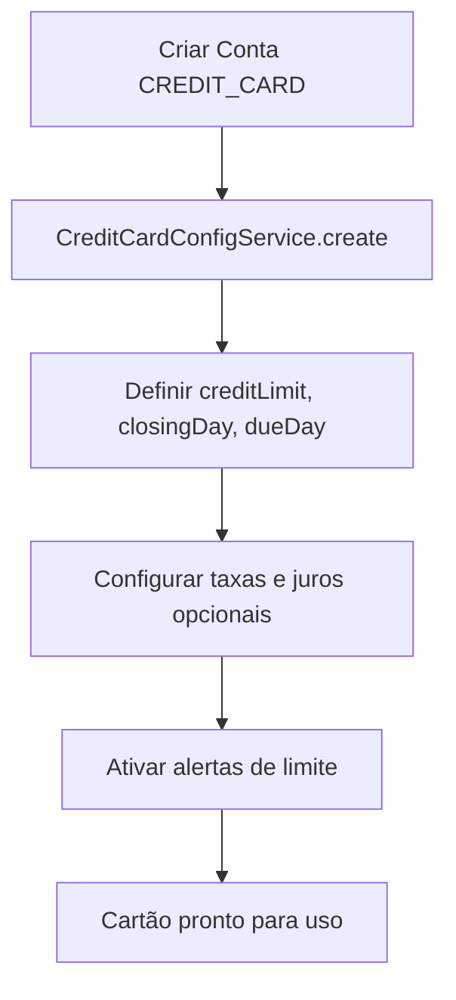
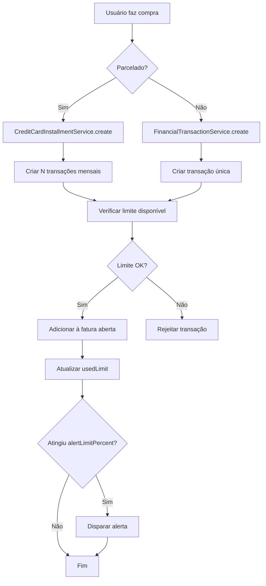
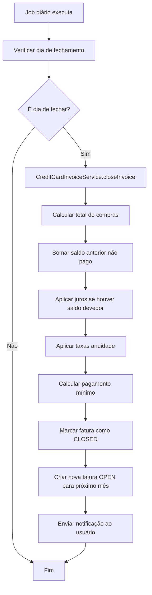
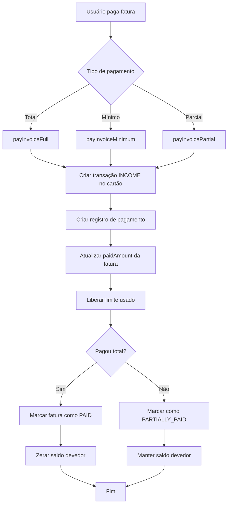

# 💳 Proposta: Sistema Robusto de Controle de Cartões de Crédito

> **Objetivo:** Implementar um sistema completo de gestão de cartões de crédito no Zenit, incluindo ciclos de faturamento, limites, faturas, parcelamento e integração com transações recorrentes.

---

## 📊 Visão Geral

### O que já existe no Zenit
✅ Contas do tipo `CREDIT_CARD` com `allowNegativeBalance`
✅ Sistema de transações com garantias ACID
✅ Suporte para `dueDate` e `effectiveDate`
✅ Transações recorrentes (modelo `RecurringTransaction`)
✅ Multi-tenant com controle de acesso granular

### O que será implementado
🎯 **Ciclos de faturamento** (billing cycles)
🎯 **Limites de crédito** com alertas
🎯 **Faturas** (invoices/statements) mensais
🎯 **Parcelamento** de compras
🎯 **Juros e encargos** automáticos
🎯 **Pagamento de faturas** (total, mínimo, parcial)
🎯 **Dashboard** de análise de gastos por cartão

---

## 🗄️ Modelo de Dados

### 1. Extensão do FinancialAccount (Cartão de Crédito)

```prisma
model FinancialAccount {
  // Campos existentes...
  id                   Int
  name                 String
  type                 AccountType
  balance              Decimal
  allowNegativeBalance Boolean

  // 🆕 NOVOS CAMPOS PARA CARTÕES
  creditCardConfig     CreditCardConfig?
  creditCardInvoices   CreditCardInvoice[]
  creditCardInstallments CreditCardInstallment[]
}
```

### 2. CreditCardConfig (Configuração do Cartão)

```prisma
model CreditCardConfig {
  id                    Int              @id @default(autoincrement())
  financialAccountId    Int              @unique
  financialAccount      FinancialAccount @relation(fields: [financialAccountId], references: [id], onDelete: Cascade)

  // Limites
  creditLimit           Decimal          @db.Decimal(15, 2)
  usedLimit             Decimal          @db.Decimal(15, 2) @default(0)
  availableLimit        Decimal          @db.Decimal(15, 2)  // Computed: creditLimit - usedLimit

  // Ciclo de Faturamento
  closingDay            Int              // 1-31: Dia do fechamento da fatura
  dueDay                Int              // 1-31: Dia do vencimento
  dueDaysAfterClosing   Int              @default(10) // Dias entre fechamento e vencimento

  // Taxas e Juros
  annualFee             Decimal?         @db.Decimal(15, 2)
  annualFeeMonthlyCharge Decimal?        @db.Decimal(15, 2)
  interestRate          Decimal?         @db.Decimal(5, 2)  // Taxa de juros mensal (%)
  latePaymentFee        Decimal?         @db.Decimal(15, 2)
  minimumPaymentPercent Decimal          @db.Decimal(5, 2) @default(10.00) // % do valor da fatura

  // Alertas
  alertLimitPercent     Decimal          @db.Decimal(5, 2) @default(80.00) // Alerta quando usar 80%
  enableLimitAlerts     Boolean          @default(true)
  enableDueAlerts       Boolean          @default(true)
  dueDaysBeforeAlert    Int              @default(3)

  // Controle
  isActive              Boolean          @default(true)
  lastInvoiceGenerated  DateTime?        // Data da última fatura gerada

  createdAt             DateTime         @default(now())
  updatedAt             DateTime         @updatedAt

  @@index([financialAccountId])
}
```

### 3. CreditCardInvoice (Fatura do Cartão)

```prisma
enum InvoiceStatus {
  OPEN           // Aberta (recebendo transações)
  CLOSED         // Fechada (não aceita mais transações)
  PAID           // Paga completamente
  PARTIALLY_PAID // Parcialmente paga
  OVERDUE        // Vencida
  CANCELED       // Cancelada
}

model CreditCardInvoice {
  id                    Int                      @id @default(autoincrement())
  financialAccountId    Int
  financialAccount      FinancialAccount         @relation(fields: [financialAccountId], references: [id], onDelete: Cascade)
  companyId             Int
  company               Company                  @relation(fields: [companyId], references: [id], onDelete: Cascade)

  // Período
  referenceMonth        Int                      // 1-12
  referenceYear         Int
  closingDate           DateTime                 // Data de fechamento
  dueDate               DateTime                 // Data de vencimento

  // Valores
  previousBalance       Decimal                  @db.Decimal(15, 2) @default(0)
  purchasesAmount       Decimal                  @db.Decimal(15, 2) @default(0)
  paymentsAmount        Decimal                  @db.Decimal(15, 2) @default(0)
  interestAmount        Decimal                  @db.Decimal(15, 2) @default(0)
  feesAmount            Decimal                  @db.Decimal(15, 2) @default(0)
  totalAmount           Decimal                  @db.Decimal(15, 2)  // Total a pagar
  minimumPayment        Decimal                  @db.Decimal(15, 2)  // Pagamento mínimo
  paidAmount            Decimal                  @db.Decimal(15, 2) @default(0)
  remainingAmount       Decimal                  @db.Decimal(15, 2)  // Computed: totalAmount - paidAmount

  // Status e Controle
  status                InvoiceStatus            @default(OPEN)
  isPaid                Boolean                  @default(false)
  paidAt                DateTime?
  isOverdue             Boolean                  @default(false)

  // Auditoria
  generatedAt           DateTime                 @default(now())
  closedAt              DateTime?

  // Relações
  transactions          CreditCardInvoiceTransaction[]
  payments              CreditCardInvoicePayment[]
  installments          CreditCardInstallment[]  @relation("InvoiceInstallments")

  createdAt             DateTime                 @default(now())
  updatedAt             DateTime                 @updatedAt

  @@unique([financialAccountId, referenceYear, referenceMonth])
  @@index([financialAccountId, status])
  @@index([companyId, dueDate])
  @@index([dueDate, status])
}
```

### 4. CreditCardInvoiceTransaction (Vínculo Transação-Fatura)

```prisma
model CreditCardInvoiceTransaction {
  id                    Int                   @id @default(autoincrement())
  invoiceId             Int
  invoice               CreditCardInvoice     @relation(fields: [invoiceId], references: [id], onDelete: Cascade)
  transactionId         Int
  transaction           FinancialTransaction  @relation(fields: [transactionId], references: [id], onDelete: Cascade)

  // Controle de parcelamento
  installmentId         Int?
  installment           CreditCardInstallment? @relation(fields: [installmentId], references: [id])
  isInstallment         Boolean               @default(false)

  createdAt             DateTime              @default(now())

  @@unique([invoiceId, transactionId])
  @@index([invoiceId])
  @@index([transactionId])
  @@index([installmentId])
}
```

### 5. CreditCardInstallment (Parcelamento)

```prisma
model CreditCardInstallment {
  id                    Int                   @id @default(autoincrement())
  financialAccountId    Int
  financialAccount      FinancialAccount      @relation(fields: [financialAccountId], references: [id], onDelete: Cascade)
  companyId             Int
  company               Company               @relation(fields: [companyId], references: [id], onDelete: Cascade)

  // Dados da compra
  description           String
  totalAmount           Decimal               @db.Decimal(15, 2)  // Valor total da compra
  numberOfInstallments  Int                   // Quantidade de parcelas
  installmentAmount     Decimal               @db.Decimal(15, 2)  // Valor de cada parcela

  // Controle
  purchaseDate          DateTime              // Data da compra
  firstDueDate          DateTime              // Vencimento da primeira parcela
  categoryId            Int?
  category              FinancialCategory?    @relation(fields: [categoryId], references: [id])

  // Auditoria
  createdBy             Int
  createdByUser         User                  @relation(fields: [createdBy], references: [id])

  // Relações
  invoiceTransactions   CreditCardInvoiceTransaction[]
  installmentPayments   CreditCardInstallmentPayment[]

  createdAt             DateTime              @default(now())
  updatedAt             DateTime              @updatedAt

  @@index([financialAccountId])
  @@index([companyId])
}
```

### 6. CreditCardInstallmentPayment (Pagamento de Parcela)

```prisma
model CreditCardInstallmentPayment {
  id                    Int                      @id @default(autoincrement())
  installmentId         Int
  installment           CreditCardInstallment    @relation(fields: [installmentId], references: [id], onDelete: Cascade)
  invoiceId             Int
  invoice               CreditCardInvoice        @relation(fields: [invoiceId], references: [id])

  // Dados do pagamento
  installmentNumber     Int                      // Número da parcela (1 de 12, 2 de 12, etc.)
  amount                Decimal                  @db.Decimal(15, 2)
  dueDate               DateTime
  isPaid                Boolean                  @default(false)
  paidAt                DateTime?

  createdAt             DateTime                 @default(now())

  @@unique([installmentId, installmentNumber])
  @@index([installmentId])
  @@index([invoiceId])
}
```

### 7. CreditCardInvoicePayment (Pagamento de Fatura)

```prisma
enum PaymentType {
  FULL_PAYMENT     // Pagamento total
  MINIMUM_PAYMENT  // Pagamento mínimo
  PARTIAL_PAYMENT  // Pagamento parcial
}

model CreditCardInvoicePayment {
  id                    Int                   @id @default(autoincrement())
  invoiceId             Int
  invoice               CreditCardInvoice     @relation(fields: [invoiceId], references: [id], onDelete: Cascade)
  transactionId         Int?                  // Referência à transação de pagamento
  transaction           FinancialTransaction? @relation(fields: [transactionId], references: [id])

  // Dados do pagamento
  amount                Decimal               @db.Decimal(15, 2)
  paymentType           PaymentType
  paymentDate           DateTime
  notes                 String?

  // Auditoria
  createdBy             Int
  createdByUser         User                  @relation(fields: [createdBy], references: [id])

  createdAt             DateTime              @default(now())

  @@index([invoiceId])
  @@index([transactionId])
}
```

---

## 🏗️ Arquitetura dos Serviços

### 1. CreditCardConfigService
**Responsabilidade:** Gerenciar configurações de cartões de crédito

```typescript
class CreditCardConfigService {
  // CRUD básico
  static async create(accountId: number, config: CreateCreditCardConfig): Promise<CreditCardConfig>
  static async update(accountId: number, config: UpdateCreditCardConfig): Promise<CreditCardConfig>
  static async getByAccountId(accountId: number): Promise<CreditCardConfig | null>
  static async delete(accountId: number): Promise<void>

  // Limites
  static async updateUsedLimit(accountId: number, amount: number): Promise<void>
  static async checkLimitAvailable(accountId: number, amount: number): Promise<boolean>
  static async getAvailableLimit(accountId: number): Promise<number>
  static async checkLimitAlert(accountId: number): Promise<{ shouldAlert: boolean; percentage: number }>

  // Ciclo de faturamento
  static async getNextClosingDate(accountId: number): Promise<Date>
  static async getNextDueDate(accountId: number): Promise<Date>
  static async calculateDueDate(closingDate: Date, dueDays: number): Promise<Date>
}
```

### 2. CreditCardInvoiceService
**Responsabilidade:** Gerenciar faturas de cartões de crédito

```typescript
class CreditCardInvoiceService {
  // Geração de faturas
  static async generateInvoice(accountId: number, referenceMonth: number, referenceYear: number): Promise<CreditCardInvoice>
  static async generateInvoicesForAllCards(companyId: number, referenceMonth: number, referenceYear: number): Promise<CreditCardInvoice[]>

  // Consultas
  static async getCurrentInvoice(accountId: number): Promise<CreditCardInvoice | null>
  static async getInvoiceByPeriod(accountId: number, month: number, year: number): Promise<CreditCardInvoice | null>
  static async listInvoices(accountId: number, params?: { status?: InvoiceStatus; limit?: number }): Promise<CreditCardInvoice[]>
  static async getInvoiceDetails(invoiceId: number): Promise<InvoiceDetails>

  // Cálculos
  static async calculateInvoiceAmount(invoiceId: number): Promise<InvoiceAmounts>
  static async calculateMinimumPayment(invoiceId: number): Promise<number>
  static async applyInterest(invoiceId: number): Promise<void>
  static async applyFees(invoiceId: number): Promise<void>

  // Ciclo de vida
  static async closeInvoice(invoiceId: number): Promise<CreditCardInvoice>
  static async reopenInvoice(invoiceId: number): Promise<CreditCardInvoice>
  static async markAsOverdue(invoiceId: number): Promise<CreditCardInvoice>

  // Vinculação de transações
  static async addTransactionToInvoice(invoiceId: number, transactionId: number): Promise<void>
  static async removeTransactionFromInvoice(invoiceId: number, transactionId: number): Promise<void>
  static async getInvoiceTransactions(invoiceId: number): Promise<FinancialTransaction[]>
}
```

### 3. CreditCardInstallmentService
**Responsabilidade:** Gerenciar parcelamento de compras

```typescript
class CreditCardInstallmentService {
  // Criação de parcelamento
  static async createInstallmentPurchase(data: {
    accountId: number;
    description: string;
    totalAmount: number;
    numberOfInstallments: number;
    purchaseDate: Date;
    categoryId?: number;
    companyId: number;
    createdBy: number;
  }): Promise<{
    installment: CreditCardInstallment;
    transactions: FinancialTransaction[];
  }>

  // Consultas
  static async getInstallmentById(id: number): Promise<CreditCardInstallment | null>
  static async listByAccount(accountId: number): Promise<CreditCardInstallment[]>
  static async getActiveInstallments(accountId: number): Promise<CreditCardInstallment[]>
  static async getInstallmentDetails(id: number): Promise<InstallmentDetails>

  // Cálculos
  static async calculateInstallmentAmount(totalAmount: number, numberOfInstallments: number): Promise<number>
  static async getRemainingInstallments(installmentId: number): Promise<number>
  static async getTotalRemaining(installmentId: number): Promise<number>

  // Atualizações
  static async cancelInstallment(id: number): Promise<void>
  static async adjustInstallment(id: number, newAmount: number): Promise<void>
}
```

### 4. CreditCardPaymentService
**Responsabilidade:** Gerenciar pagamentos de faturas

```typescript
class CreditCardPaymentService {
  // Pagamentos
  static async payInvoiceFull(invoiceId: number, paymentData: PaymentData): Promise<CreditCardInvoicePayment>
  static async payInvoiceMinimum(invoiceId: number, paymentData: PaymentData): Promise<CreditCardInvoicePayment>
  static async payInvoicePartial(invoiceId: number, amount: number, paymentData: PaymentData): Promise<CreditCardInvoicePayment>

  // Validações
  static async canPayInvoice(invoiceId: number): Promise<{ canPay: boolean; reason?: string }>
  static async validatePaymentAmount(invoiceId: number, amount: number): Promise<boolean>

  // Consultas
  static async getInvoicePayments(invoiceId: number): Promise<CreditCardInvoicePayment[]>
  static async getPaymentHistory(accountId: number, params?: { startDate?: Date; endDate?: Date }): Promise<CreditCardInvoicePayment[]>

  // Integração
  static async createPaymentTransaction(invoiceId: number, amount: number, fromAccountId: number, userId: number): Promise<FinancialTransaction>
}
```

### 5. CreditCardReportService
**Responsabilidade:** Relatórios e análises

```typescript
class CreditCardReportService {
  // Dashboard
  static async getDashboard(accountId: number): Promise<CreditCardDashboard>
  static async getSpendingAnalysis(accountId: number, params: { startDate: Date; endDate: Date }): Promise<SpendingAnalysis>
  static async getCategoryBreakdown(accountId: number, month: number, year: number): Promise<CategoryBreakdown[]>

  // Análises
  static async getAverageMontlySpending(accountId: number, months: number): Promise<number>
  static async getPredictedNextInvoice(accountId: number): Promise<PredictedInvoice>
  static async getPaymentHistory(accountId: number, months: number): Promise<PaymentHistory[]>

  // Alertas
  static async getLimitAlerts(companyId: number): Promise<LimitAlert[]>
  static async getDueAlerts(companyId: number): Promise<DueAlert[]>
  static async getOverdueInvoices(companyId: number): Promise<CreditCardInvoice[]>
}
```

---

## 🔄 Fluxos Principais

### Fluxo 1: Criação de Cartão de Crédito



**Implementação:**
```typescript
// 1. Criar conta
const account = await FinancialAccountService.create({
  name: "Nubank",
  type: AccountType.CREDIT_CARD,
  allowNegativeBalance: true,
  companyId: 1
});

// 2. Configurar cartão
const config = await CreditCardConfigService.create(account.id, {
  creditLimit: 5000.00,
  closingDay: 5,
  dueDay: 15,
  interestRate: 10.5,
  minimumPaymentPercent: 10,
  alertLimitPercent: 80
});
```

### Fluxo 2: Compra no Cartão de Crédito



**Implementação (Compra à vista):**
```typescript
// 1. Criar transação
const transaction = await FinancialTransactionService.create({
  description: "Compra Mercado",
  amount: 250.00,
  date: new Date(),
  type: TransactionType.EXPENSE,
  status: TransactionStatus.COMPLETED,
  fromAccountId: cardAccountId,
  categoryId: categoryId,
  companyId: 1,
  createdBy: userId
});

// 2. Verificar limite
const hasLimit = await CreditCardConfigService.checkLimitAvailable(cardAccountId, 250.00);
if (!hasLimit) throw new Error("Limite insuficiente");

// 3. Adicionar à fatura atual
const currentInvoice = await CreditCardInvoiceService.getCurrentInvoice(cardAccountId);
await CreditCardInvoiceService.addTransactionToInvoice(currentInvoice.id, transaction.id);

// 4. Atualizar limite usado
await CreditCardConfigService.updateUsedLimit(cardAccountId, 250.00);
```

**Implementação (Compra parcelada):**
```typescript
const { installment, transactions } = await CreditCardInstallmentService.createInstallmentPurchase({
  accountId: cardAccountId,
  description: "Notebook Dell",
  totalAmount: 3600.00,
  numberOfInstallments: 12,
  purchaseDate: new Date(),
  categoryId: categoryId,
  companyId: 1,
  createdBy: userId
});

// Resultado: 12 transações de R$ 300,00 cada, distribuídas nas próximas 12 faturas
```

### Fluxo 3: Fechamento de Fatura



**Implementação:**
```typescript
class InvoiceClosingJob {
  static async execute(): Promise<void> {
    const companies = await this.getAllActiveCompanies();

    for (const company of companies) {
      const cards = await this.getCompanyCreditCards(company.id);

      for (const card of cards) {
        const config = await CreditCardConfigService.getByAccountId(card.id);
        const today = new Date();

        if (today.getDate() === config.closingDay) {
          const currentInvoice = await CreditCardInvoiceService.getCurrentInvoice(card.id);

          if (currentInvoice && currentInvoice.status === 'OPEN') {
            // 1. Calcular totais
            const amounts = await CreditCardInvoiceService.calculateInvoiceAmount(currentInvoice.id);

            // 2. Aplicar juros se há saldo anterior não pago
            if (amounts.previousBalance > 0) {
              await CreditCardInvoiceService.applyInterest(currentInvoice.id);
            }

            // 3. Aplicar taxas (anuidade mensal, se configurada)
            await CreditCardInvoiceService.applyFees(currentInvoice.id);

            // 4. Calcular pagamento mínimo
            const minimumPayment = await CreditCardInvoiceService.calculateMinimumPayment(currentInvoice.id);

            // 5. Fechar fatura
            await CreditCardInvoiceService.closeInvoice(currentInvoice.id);

            // 6. Gerar próxima fatura
            const nextMonth = today.getMonth() + 1;
            const nextYear = nextMonth > 11 ? today.getFullYear() + 1 : today.getFullYear();
            await CreditCardInvoiceService.generateInvoice(
              card.id,
              nextMonth % 12,
              nextYear
            );

            logger.info('Invoice closed successfully', {
              cardId: card.id,
              invoiceId: currentInvoice.id,
              totalAmount: amounts.totalAmount,
              minimumPayment
            });
          }
        }
      }
    }
  }
}
```

### Fluxo 4: Pagamento de Fatura



**Implementação:**
```typescript
// Pagamento total
const payment = await CreditCardPaymentService.payInvoiceFull(invoiceId, {
  fromAccountId: checkingAccountId, // Conta corrente que vai pagar
  paymentDate: new Date(),
  userId: userId
});

// Internamente:
// 1. Cria transação de transferência (checking → credit_card)
const paymentTransaction = await FinancialTransactionService.create({
  description: `Pagamento Fatura ${invoice.referenceMonth}/${invoice.referenceYear}`,
  amount: invoice.totalAmount,
  date: new Date(),
  type: TransactionType.TRANSFER,
  status: TransactionStatus.COMPLETED,
  fromAccountId: checkingAccountId,
  toAccountId: cardAccountId,
  companyId: invoice.companyId,
  createdBy: userId
});

// 2. Registra pagamento
await CreditCardInvoicePayment.create({
  invoiceId: invoice.id,
  transactionId: paymentTransaction.id,
  amount: invoice.totalAmount,
  paymentType: PaymentType.FULL_PAYMENT,
  paymentDate: new Date(),
  createdBy: userId
});

// 3. Atualiza fatura
await CreditCardInvoice.update(invoice.id, {
  paidAmount: invoice.totalAmount,
  remainingAmount: 0,
  status: InvoiceStatus.PAID,
  isPaid: true,
  paidAt: new Date()
});

// 4. Libera limite
await CreditCardConfigService.updateUsedLimit(cardAccountId, -invoice.totalAmount);
```

---

## 🎯 Casos de Uso Detalhados

### Caso 1: Compra Parcelada em 12x

**Cenário:** Usuário compra notebook de R$ 3.600,00 em 12x sem juros

```typescript
const result = await CreditCardInstallmentService.createInstallmentPurchase({
  accountId: nubank.id,
  description: "Notebook Dell Inspiron 15",
  totalAmount: 3600.00,
  numberOfInstallments: 12,
  purchaseDate: new Date('2025-01-15'),
  categoryId: electronicsCategory.id,
  companyId: 1,
  createdBy: userId
});

// Resultado:
// - 1 registro CreditCardInstallment
// - 12 transações de R$ 300,00 cada
// - Distribuídas:
//   - Parcela 1/12: Fatura Janeiro (R$ 300)
//   - Parcela 2/12: Fatura Fevereiro (R$ 300)
//   - ...
//   - Parcela 12/12: Fatura Dezembro (R$ 300)
```

### Caso 2: Fatura com Juros por Pagamento Parcial

**Cenário:** Usuário pagou apenas R$ 500 de uma fatura de R$ 2.000. No mês seguinte, há juros.

```typescript
// Mês 1: Fatura de Janeiro
const janInvoice = {
  totalAmount: 2000.00,
  minimumPayment: 200.00  // 10% do total
};

// Usuário paga parcial (R$ 500)
await CreditCardPaymentService.payInvoicePartial(janInvoice.id, 500.00, {
  fromAccountId: checkingAccount.id,
  paymentDate: new Date('2025-01-15'),
  userId: userId
});

// Estado após pagamento:
// - paidAmount: 500.00
// - remainingAmount: 1500.00
// - status: PARTIALLY_PAID

// Dia 5 de Fevereiro: Fechamento da próxima fatura
const febInvoice = await CreditCardInvoiceService.generateInvoice(
  nubank.id,
  2,  // Fevereiro
  2025
);

// Calcular juros sobre saldo devedor (R$ 1.500)
const interestRate = 10.5; // 10.5% ao mês
const interestAmount = 1500.00 * (interestRate / 100); // R$ 157.50

await CreditCardInvoiceService.applyInterest(febInvoice.id);

// Fatura de Fevereiro:
// - previousBalance: 1500.00
// - purchasesAmount: 800.00 (novas compras)
// - interestAmount: 157.50
// - totalAmount: 2457.50
```

### Caso 3: Alerta de Limite

**Cenário:** Cartão com limite de R$ 5.000, alerta configurado em 80%

```typescript
const config = await CreditCardConfigService.getByAccountId(nubank.id);
// creditLimit: 5000.00
// alertLimitPercent: 80.00
// Limite de alerta: R$ 4.000

// Após várias compras, usado: R$ 4.200
const alert = await CreditCardConfigService.checkLimitAlert(nubank.id);
// {
//   shouldAlert: true,
//   percentage: 84.00,
//   usedAmount: 4200.00,
//   availableAmount: 800.00,
//   limitAmount: 5000.00
// }

// Sistema envia notificação ao usuário
await NotificationService.send({
  userId: userId,
  type: 'CREDIT_LIMIT_ALERT',
  title: 'Alerta de Limite',
  message: 'Você utilizou 84% do limite do cartão Nubank. Limite disponível: R$ 800,00'
});
```

---

## 📅 Plano de Implementação

### Fase 1: Fundação (Semana 1-2) - 32h

**Sprint 1.1: Modelo de Dados**
- [ ] Criar migrations para novas tabelas
- [ ] Adicionar relacionamentos em Prisma schema
- [ ] Testar integridade referencial
- **Entregas:** Schema completo, migrations testadas

**Sprint 1.2: CreditCardConfigService**
- [ ] Implementar CRUD de configurações
- [ ] Implementar lógica de limites
- [ ] Implementar cálculo de datas de fechamento
- **Entregas:** Service completo com testes

**Sprint 1.3: CreditCardInvoiceService (Básico)**
- [ ] Implementar geração de faturas
- [ ] Implementar vinculação de transações
- [ ] Implementar cálculos básicos
- **Entregas:** Geração automática funcionando

### Fase 2: Funcionalidades Core (Semana 3-4) - 40h

**Sprint 2.1: Parcelamento**
- [ ] Implementar CreditCardInstallmentService
- [ ] Integrar com geração de transações
- [ ] Criar endpoints REST
- **Entregas:** Compras parceladas funcionando

**Sprint 2.2: Fechamento de Faturas**
- [ ] Implementar job de fechamento
- [ ] Implementar cálculo de juros
- [ ] Implementar cálculo de pagamento mínimo
- **Entregas:** Fechamento automático funcionando

**Sprint 2.3: Pagamento de Faturas**
- [ ] Implementar CreditCardPaymentService
- [ ] Integrar com transações
- [ ] Implementar liberação de limite
- **Entregas:** Pagamento completo funcionando

### Fase 3: UX e Relatórios (Semana 5-6) - 32h

**Sprint 3.1: Frontend - Gestão de Cartões**
- [ ] Tela de configuração de cartão
- [ ] Tela de visualização de fatura
- [ ] Formulário de compra parcelada
- **Entregas:** UI completa para cartões

**Sprint 3.2: Frontend - Pagamento e Dashboards**
- [ ] Tela de pagamento de fatura
- [ ] Dashboard de análise de gastos
- [ ] Gráficos de evolução
- **Entregas:** Dashboards interativos

**Sprint 3.3: Relatórios**
- [ ] Implementar CreditCardReportService
- [ ] Exportação de faturas em PDF
- [ ] Alertas e notificações
- **Entregas:** Relatórios completos

### Fase 4: Otimizações (Semana 7) - 16h

**Sprint 4.1: Performance e Automação**
- [ ] Jobs de fechamento e alertas
- [ ] Cache de consultas frequentes
- [ ] Índices otimizados
- **Entregas:** Sistema otimizado

**Sprint 4.2: Testes e Documentação**
- [ ] Testes unitários completos
- [ ] Testes de integração
- [ ] Documentação de APIs
- **Entregas:** Cobertura > 80%

---

## 🔧 Endpoints da API

### Credit Card Config
```
POST   /api/financial/accounts/:accountId/credit-card/config
GET    /api/financial/accounts/:accountId/credit-card/config
PUT    /api/financial/accounts/:accountId/credit-card/config
DELETE /api/financial/accounts/:accountId/credit-card/config
GET    /api/financial/accounts/:accountId/credit-card/available-limit
```

### Invoices
```
POST   /api/financial/credit-cards/:accountId/invoices/generate
GET    /api/financial/credit-cards/:accountId/invoices
GET    /api/financial/credit-cards/:accountId/invoices/current
GET    /api/financial/credit-cards/:accountId/invoices/:invoiceId
POST   /api/financial/credit-cards/invoices/:invoiceId/close
GET    /api/financial/credit-cards/invoices/:invoiceId/transactions
POST   /api/financial/credit-cards/invoices/:invoiceId/apply-interest
```

### Installments
```
POST   /api/financial/credit-cards/:accountId/installments
GET    /api/financial/credit-cards/:accountId/installments
GET    /api/financial/credit-cards/installments/:installmentId
DELETE /api/financial/credit-cards/installments/:installmentId
```

### Payments
```
POST   /api/financial/credit-cards/invoices/:invoiceId/payments/full
POST   /api/financial/credit-cards/invoices/:invoiceId/payments/minimum
POST   /api/financial/credit-cards/invoices/:invoiceId/payments/partial
GET    /api/financial/credit-cards/invoices/:invoiceId/payments
GET    /api/financial/credit-cards/:accountId/payment-history
```

### Reports
```
GET    /api/financial/credit-cards/:accountId/dashboard
GET    /api/financial/credit-cards/:accountId/spending-analysis
GET    /api/financial/credit-cards/:accountId/category-breakdown
GET    /api/financial/credit-cards/company/:companyId/alerts
```

---

## 🎯 Métricas de Sucesso

### Performance
- ✅ Geração de fatura < 2s
- ✅ Consulta de dashboard < 500ms
- ✅ Criação de parcelamento < 1s

### Funcionalidade
- ✅ 100% das compras parceladas processadas corretamente
- ✅ 100% das faturas fechadas no dia correto
- ✅ Cálculo de juros preciso (2 casas decimais)

### Usabilidade
- ✅ Dashboard intuitivo com principais métricas
- ✅ Alertas em tempo real
- ✅ Exportação de faturas em PDF

---

## 🚨 Pontos de Atenção

### Segurança
- 🔒 Todas as operações financeiras com ACID
- 🔒 Validação de limites antes de criar transação
- 🔒 Auditoria completa de todas as operações
- 🔒 Isolamento multi-tenant rigoroso

### Performance
- ⚡ Cache de faturas fechadas (imutáveis)
- ⚡ Índices em datas de vencimento
- ⚡ Jobs otimizados com processamento paralelo

### Consistência
- ✅ Limite usado sempre sincronizado
- ✅ Parcelas sempre vinculadas à fatura correta
- ✅ Pagamentos sempre registrados em transação
- ✅ Rollback completo em caso de erro

### Escalabilidade
- 📈 Paginação em todas as listagens
- 📈 Jobs executam por company (paralelizável)
- 📈 Estrutura preparada para milhares de cartões

---

## 📚 Próximos Passos

1. **Revisar proposta** com stakeholders
2. **Validar modelo de dados** com DBA
3. **Criar protótipo de UI** para validação
4. **Iniciar Fase 1** após aprovação

---

## 📞 Referências

- Documentação Zenit: `/docs/despesas-fixas-cards.md`
- Schema Prisma: `/backend/prisma/schema.prisma`
- FinancialTransactionService: `/backend/src/services/financial-transaction.service.ts`

---

**Estimativa Total:** 120 horas (6 semanas)
**Complexidade:** Alta
**Valor de Negócio:** Muito Alto
**Risco:** Médio (requer testes extensivos)
